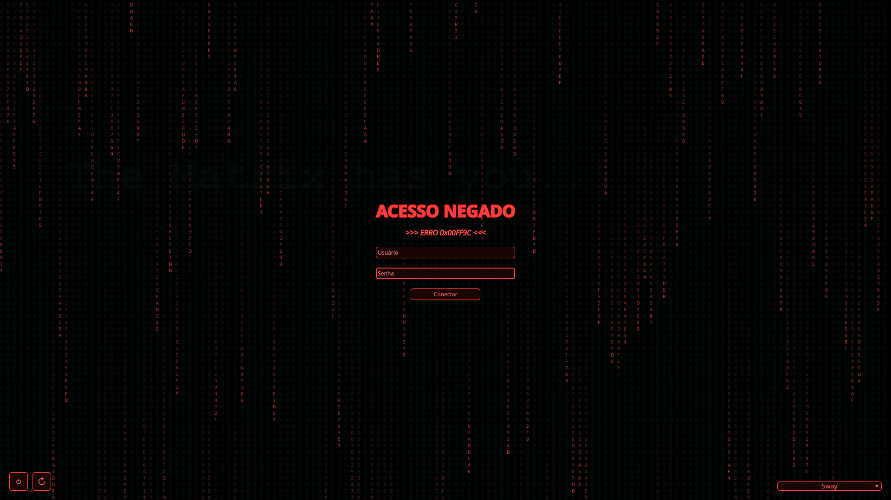
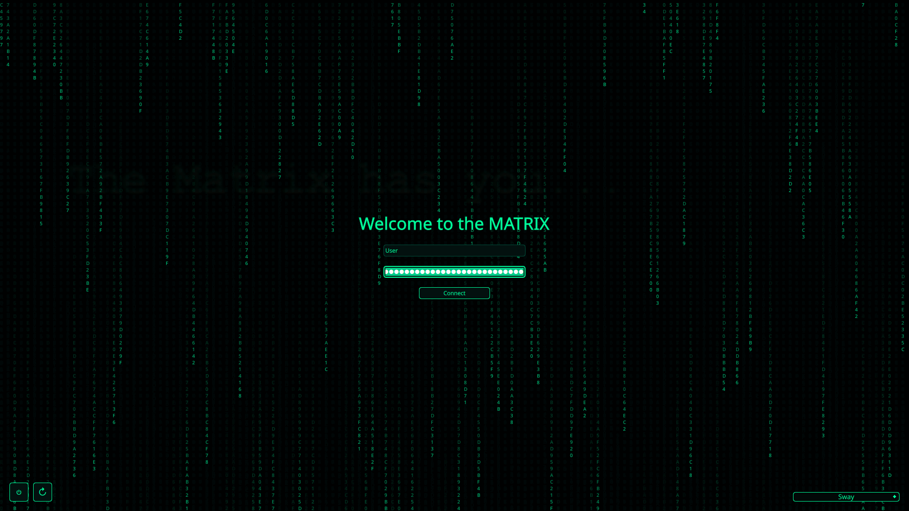
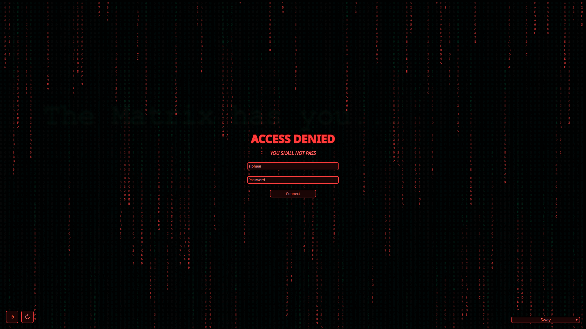
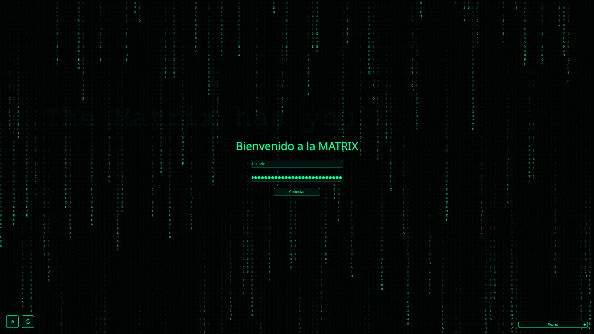
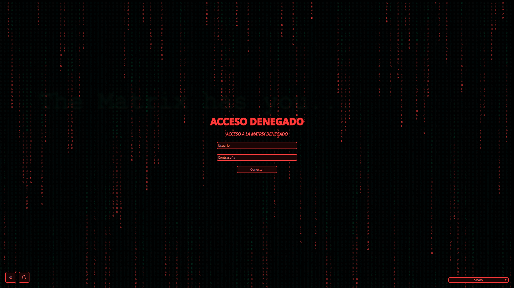

#Forked Theme

# SDDM Hacker Fork Theme - PT-BR


## Versão 1.0
Este é um tema SDDM estilo hacker com fundo escuro, texto verde neon e efeito de chuva digital da Matrix.

## Versão 2.0 (Nova!)


Tudo da versão 1.0, mas com sistema de erro dinâmico: quando a senha está incorreta, toda a interface muda para tons vermelhos, a chuva Matrix fica vermelha e mensagens de erro estilo Matrix aparecem ("ACESSO NEGADO", "VOCÊ NÃO É O ESCOLHIDO", "AGENTES: ACESSO BLOQUEADO" entre outras). As cores voltam ao normal ao começar a digitar.
-
Para Usar a versão 2.0 use os arquivos da pasta; Main Português Brasil.
## 

# SDDM Hacker Fork Theme - EN



## Version 1.0

This is a hacker-style SDDM theme with a dark background, neon green text, and a Matrix digital rain effect.
-
To use in English(1.0), delete Main.qml and rename main.qml.EN to Main.qml.


## Version 2.0 (New!)


Everything from version 1.0, plus a dynamic error system: when the password is incorrect, the entire interface turns red, the Matrix rain turns red, and Matrix-style error messages appear ("ACCESS DENIED", "YOU ARE NOT THE ONE", "AGENTS: ACCESS BLOCKED" among others). Colors return to normal when you start typing.

To use in English(2.0), use Main English folder.

## 


# SDDM Hacker Fork Theme - ES


## Versión 1.0
Este es un tema SDDM estilo hacker con fondo oscuro, texto verde neón y efecto de lluvia digital de Matrix.
-
Para usar en español(1.0), elimine Main.qml y renombre main.qml.ES a Main.qml.


## Versión 2.0 (¡Nueva!)


Todo de la versión 1.0, más un sistema de error dinámico: cuando la contraseña es incorrecta, toda la interfaz se vuelve roja, la lluvia Matrix se vuelve roja y aparecen mensajes de error estilo Matrix ("ACCESO DENEGADO", "NO ERES EL ELEGIDO", "AGENTES: ACCESO BLOQUEADO" entre otros). Los colores vuelven a la normalidad al empezar a escribir.

Para usar en Español(2.0), use la carpeta Main Español.
## 


### PT-BR

Instalação

1. Copie a pasta do tema para o diretório de temas do SDDM:

```bash
sudo cp -r /caminho/da/pasta/do/tema /usr/share/sddm/themes/
```

2. Abra o arquivo de configuração do SDDM:

```bash
sudo nano /etc/sddm.conf
```

3. Defina o tema que você copiou:

```ini
[Theme]
Current=nome_do_tema
```

4. Salve e reinicie o SDDM:

```bash
sudo systemctl restart sddm
```

---

### EN

Installation

1. Copy the theme folder to the SDDM themes directory:

```bash
sudo cp -r /path/to/theme/folder /usr/share/sddm/themes/
```

2. Open the SDDM configuration file:

```bash
sudo nano /etc/sddm.conf
```

3. Set the theme you copied:

```ini
[Theme]
Current=theme_name
```

4. Save and restart SDDM:

```bash
sudo systemctl restart sddm
```

---

### ES

Instalación

1. Copia la carpeta del tema al directorio de temas de SDDM:

```bash
sudo cp -r /ruta/a/la/carpeta/del/tema /usr/share/sddm/themes/
```

2. Abre el archivo de configuración de SDDM:

```bash
sudo nano /etc/sddm.conf
```

3. Establece el tema que copiaste:

```ini
[Theme]
Current=nombre_del_tema
```

4. Guarda y reinicia SDDM:

```bash
sudo systemctl restart sddm
```


---

### PT-BR

## Notas

### Versão 1.0
* No Main.qml se edita o texto Bem-vindo a matrix e outros;

* 		Text {
			text: "Bem-vindo a MATRIX"
			color: "#00ff9c"
			font.pixelSize: 36
			style: Text.Outline
			styleColor: "#003322"
			Layout.alignment: Qt.AlignHCenter
		}

* O efeito Matrix é leve, mas pode ser desativado removendo os componentes `Canvas` e `Timer` em `Main.qml` caso haja problemas de desempenho.

### Versão 2.0 (Adicional)
* Adicionado estado de erro global que muda toda a interface para vermelho
* Mensagens de erro aleatórias estilo Matrix ("ACESSO NEGADO", "VOCÊ NÃO É O ESCOLHIDO", "AGENTES: ACESSO BLOQUEADO", etc.)
* Subtítulo dinâmico que aparece junto com "ACESSO NEGADO"
* A chuva Matrix também fica vermelha durante o erro
* Timer de 3 segundos para limpar mensagem de erro automaticamente
* Campo de usuário vazio exibe "⚠ IDENTIFICAÇÃO NÃO FORNECIDA ⚠"
* Para personalizar as mensagens de erro, procure pelo array `messages` dentro do `errorSubtitle` no `Main.qml`

---

### EN

## Notes

### Version 1.0
* In the Main.qml is edited the text and others:

* 		Text {
			text: "Welcome to the MATRIX""
			color: "#00ff9c"
			font.pixelSize: 36
			style: Text.Outline
			styleColor: "#003322"
			Layout.alignment: Qt.AlignHCenter
		}

* The Matrix effect is lightweight, but it can be disabled by removing the `Canvas` and `Timer` components in `Main.qml` if performance is an issue.

### Version 2.0 (Additional)
* Added global error state that changes the entire interface to red
* Random Matrix-style error messages ("ACCESS DENIED", "YOU ARE NOT THE ONE", "AGENTS: ACCESS BLOCKED", etc.)
* Dynamic subtitle that appears alongside "ACCESS DENIED"
* The Matrix rain also turns red during error
* 3-second timer to automatically clear error messages
* Empty username field displays "⚠ IDENTIFICATION NOT PROVIDED ⚠"
* To customize error messages, look for the `messages` array inside `errorSubtitle` in `Main.qml`

---

### ES

## Notas

### Versión 1.0
* En la parte Main.qml se edita el texto Bienvenido y otros;

* 		Text {
			text: "Bienvenido a la MATRIX"
			color: "#00ff9c"
			font.pixelSize: 36
			style: Text.Outline
			styleColor: "#003322"
			Layout.alignment: Qt.AlignHCenter
		}

* El efecto Matrix es ligero, pero se puede desactivar eliminando los componentes `Canvas` y `Timer` en `Main.qml` si hay problemas de rendimiento.

### Versión 2.0 (Adicional)
* Añadido estado de error global que cambia toda la interfaz a rojo
* Mensajes de error aleatorios estilo Matrix ("ACCESO DENEGADO", "NO ERES EL ELEGIDO", "AGENTES: ACCESO BLOQUEADO", etc.)
* Subtítulo dinámico que aparece junto con "ACCESO DENEGADO"
* La lluvia Matrix también se vuelve roja durante el error
* Temporizador de 3 segundos para limpiar mensajes de error automáticamente
* Campo de usuario vacío muestra "⚠ IDENTIFICACIÓN NO PROPORCIONADA ⚠"
* Para personalizar mensajes de error, busca el array `messages` dentro de `errorSubtitle` en `Main.qml`
