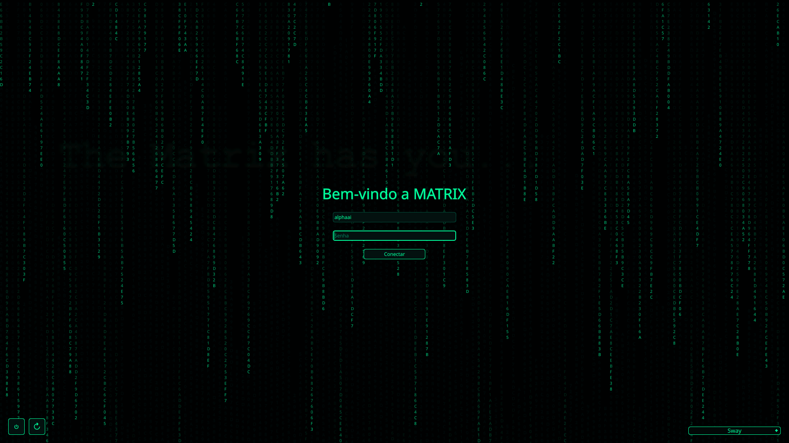

#Forked Theme

# SDDM Hacker Fork Theme - PT-BR

Este é um tema SDDM estilo hacker com fundo escuro, texto verde neon e efeito de chuva digital da Matrix.

# SDDM Hacker Fork Theme - EN
This is a hacker-style SDDM theme with a dark background, neon green text, and a Matrix digital rain effect.

# SDDM Hacker Fork Theme - ES
Este es un tema SDDM estilo hacker con fondo oscuro, texto verde neón y efecto de lluvia digital de Matrix.

## 



### PT-BR

Instalação

1. Copie a pasta do tema para o diretório de temas do SDDM:

```bash
sudo cp -r /caminho/da/pasta/do/tema /usr/share/sddm/themes/
```

2. Abra o arquivo de configuração do SDDM:

```bash
sudo nano /etc/sddm.conf
```

3. Defina o tema que você copiou:

```ini
[Theme]
Current=nome_do_tema
```

4. Salve e reinicie o SDDM:

```bash
sudo systemctl restart sddm
```

---

### EN

Installation

1. Copy the theme folder to the SDDM themes directory:

```bash
sudo cp -r /path/to/theme/folder /usr/share/sddm/themes/
```

2. Open the SDDM configuration file:

```bash
sudo nano /etc/sddm.conf
```

3. Set the theme you copied:

```ini
[Theme]
Current=theme_name
```

4. Save and restart SDDM:

```bash
sudo systemctl restart sddm
```

---

### ES

Instalación

1. Copia la carpeta del tema al directorio de temas de SDDM:

```bash
sudo cp -r /ruta/a/la/carpeta/del/tema /usr/share/sddm/themes/
```

2. Abre el archivo de configuración de SDDM:

```bash
sudo nano /etc/sddm.conf
```

3. Establece el tema que copiaste:

```ini
[Theme]
Current=nombre_del_tema
```

4. Guarda y reinicia SDDM:

```bash
sudo systemctl restart sddm
```


---

### PT-BR

## Notas
* No main se edita o texto Bem-vindo a matrix e outros;
		Text {
			text: "Bem-vindo a MATRIX"
			color: "#00ff9c"
			font.pixelSize: 36
			style: Text.Outline
			styleColor: "#003322"
			Layout.alignment: Qt.AlignHCenter
		}

* O efeito Matrix é leve, mas pode ser desativado removendo os componentes `Canvas` e `Timer` em `Main.qml` caso haja problemas de desempenho.

---

### EN

## Notes
* In the main is edited the text and others:
		Text {
			text: "Bem-vindo a MATRIX"
			color: "#00ff9c"
			font.pixelSize: 36
			style: Text.Outline
			styleColor: "#003322"
			Layout.alignment: Qt.AlignHCenter
		}

* The Matrix effect is lightweight, but it can be disabled by removing the `Canvas` and `Timer` components in `Main.qml` if performance is an issue.

---

### ES

## Notas
* En la parte principal se edita el texto Bienvenido y otros;
		Text {
			text: "Bem-vindo a MATRIX"
			color: "#00ff9c"
			font.pixelSize: 36
			style: Text.Outline
			styleColor: "#003322"
			Layout.alignment: Qt.AlignHCenter
		}

* O efeito Matrix é leve, mas pode ser desativado removendo os componentes `Canvas` e `Timer` em `Main.qml` caso haja problemas de desempenho.

* El efecto Matrix es ligero, pero se puede desactivar eliminando los componentes `Canvas` y `Timer` en `Main.qml` si hay problemas de rendimiento.
